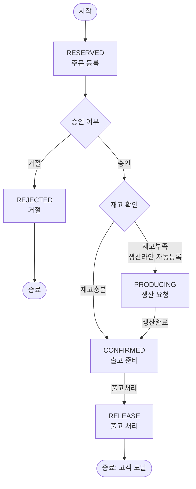

# PRD: 반도체 시료 생산주문관리 시스템 (S-Semi)

## 1. 목표/배경

가상회사 S-Semi의 반도체 시료 생산주문관리 시스템. 고객 요청(이메일, 시스템 외부)을 받아 주문담당자가 시스템에 주문을 접수하고, 생산담당자가 승인/거절하며, 재고 부족 시 생산라인에 자동 등록되어 생산 후 출고까지 이어지는 흐름을 관리한다.

기술 스택: Python, 파일 기반(JSON) 데이터 저장.

## 2. 도메인 모델

### 2.1 Sample (시료)

| 속성 | 설명 |
|---|---|
| 시료ID | 시료를 식별하는 고유 ID |
| 이름 | 시료 이름 |
| 평균생산시간 | 시료 1단위 생산에 소요되는 평균 시간 |
| 수율 | 정상시료 수 / 총생산시료 수 (예: 0.9면 100개 생산 중 정상품 90개) |

### 2.2 Inventory (재고)

Sample과 분리된 별도 엔티티. 재고는 자주 변동되는 값(주문승인 시 차감, 생산완료 시 증가)이라 정적 스펙인 Sample과 분리해 관리한다.

| 속성 | 설명 |
|---|---|
| 시료ID | Sample 참조 |
| 재고수량 | 현재 보유 재고 수량 |

### 2.3 Order (주문)

주문 1건은 단일 시료 + 수량으로 구성한다 (복수 시료 라인아이템 미지원).

| 속성 | 설명 |
|---|---|
| 주문ID | 주문을 식별하는 고유 ID |
| 고객명 | 주문 요청 고객 이름 |
| 시료ID | 주문 대상 시료 |
| 수량 | 주문 수량 |
| 상태 | RESERVED / REJECTED / CONFIRMED / PRODUCING / RELEASE |

주문 취소/수정은 RESERVED(미승인) 단계에서만 지원한다. 승인 이후(재고확인 진행/CONFIRMED/PRODUCING/RELEASE) 상태에서는 취소/수정할 수 없다.

## 3. Order 상태머신

### 3.1 구간별 담당자

| 구간 | 담당자 |
|---|---|
| RESERVED | 주문담당자 |
| 승인여부확인 ~ 출고처리(CONFIRMED) | 생산담당자 |
| PRODUCING | 생산라인 |
| END (RELEASE 이후 고객 도달) | 고객 |

| 상태 | 설명 |
|---|---|
| RESERVED | 주문 등록 상태 |
| REJECTED | 거절된 주문. 모니터링 대상에서 제외, 정상 흐름으로 취급하지 않음. 거절 사유 입력은 불필요 |
| PRODUCING | 주문 승인 완료 및 생산 요청 상태 (재고 부족으로 생산라인에 등록되어 생산 중) |
| CONFIRMED | 주문 승인 완료 및 출고 준비 상태 (재고 확보 완료, 출고 대기) |
| RELEASE | 출고 처리 상태 (출고 완료) |

출고처리는 부분출고를 지원하지 않는다. CONFIRMED 주문은 전량 한 번에 RELEASE로 전환한다.

## 4. 역할별 권한표

| 역할 | 권한 |
|---|---|
| 고객 | 이메일로 시료 요청(시스템 외부 채널, 시스템 내 직접 입력 권한 없음) |
| 주문담당자 | 주문서 작성, 주문 접수(RESERVED 생성) |
| 생산담당자 | 개발시료 등록, 주문 승인/거절 결정 |

## 5. 메인 메뉴 5종 기능 정의

1. **시료관리**: 시료 등록 / 조회 / 검색
2. **주문**: 주문 접수 / 승인 / 거절
3. **모니터링**: 주문량(상태별 카운트), 재고량(여유/부족/고갈) 확인
4. **출고처리**: CONFIRMED 상태 주문을 RELEASE 상태로 전환
5. **생산라인**: 현재 생산 중인 시료 및 대기큐(FIFO) 확인

생산라인은 N개(설정 가능, 기본값 1개)로 존재할 수 있다. PRODUCING 주문은 시료 종류와 무관하게 전체 통합 단일 FIFO 큐에 쌓이며, 라인이 유휴 상태가 될 때마다 큐 맨 앞 주문을 배정해 병렬로 생산한다.

### 5.1 모니터링 재고량 판정 기준

시료별로 아래 값을 비교해 여유/부족/고갈을 판정한다.

- 수요합계 = 해당 시료의 RESERVED 상태 주문 수량 합 + PRODUCING 상태 주문 수량 합
  (CONFIRMED는 이미 재고가 확보된 상태이므로 수요합계에서 제외)
- **고갈**: 재고수량 = 0
- **부족**: 0 < 재고수량 < 수요합계
- **여유**: 재고수량 >= 수요합계

## 6. 생산라인 계산식

- 실생산량 = ceil(부족분 / 수율)
- 총생산시간 = 평균생산시간 * 실생산량

여기서 부족분 = 주문수량 - 승인 시점의 재고수량 (재고부족으로 PRODUCING 전환된 주문 기준).

각 PRODUCING 주문은 승인 시점 기준으로 독립된 생산작업(실생산량 단위)을 하나씩 큐에 등록한다. 같은 시료에 대해 여러 주문이 PRODUCING 상태여도 부족분/실생산량은 주문별로 각각 계산하며, **PRODUCING -> CONFIRMED 전환은 해당 주문에 배정된 생산작업이 완료되는 시점**에 개별적으로 발생한다 (다른 주문의 생산 완료를 기다리지 않음).
