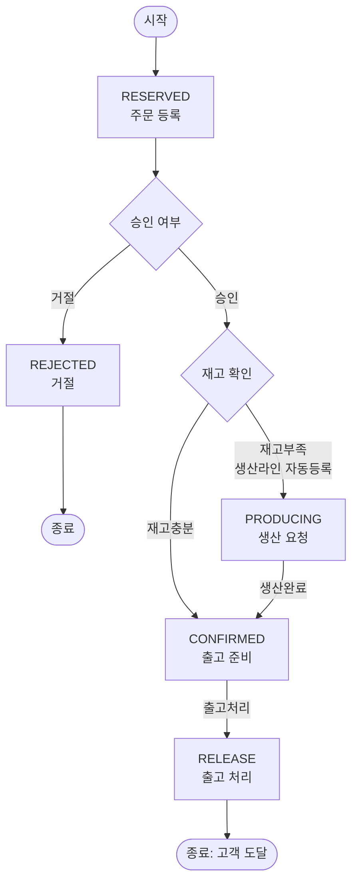

# 반도체 시료 생산주문관리 시스템 (S-Semi)

가상회사 **S-Semi**의 반도체 시료 생산주문관리 시스템이다. 고객 요청(이메일 등 시스템 외부)을 주문담당자가 시스템에 접수하면, 생산담당자가 승인/거절하고, 재고가 부족하면 생산라인에 자동 등록되어 생산 완료 후 출고까지 이어지는 흐름을 관리한다.

- 도메인 요구사항 전체: [`doc/prd/sample-order-system.md`](doc/prd/sample-order-system.md)
- 구현 설계(Phase별): [`doc/plan/sample-order-system.md`](doc/plan/sample-order-system.md)

## 무엇을 관리하는 시스템인가



주문 하나는 시료(Sample) 1종 + 수량으로 구성되고, 위 상태머신을 따라 이동한다. 재고가 부족하면 부족분만큼 자동으로 생산 작업이 잡히고(수율/생산시간 계산 포함), 생산이 끝나면 잉여분까지 재고에 반영된 뒤 주문이 CONFIRMED로 넘어간다.

## 아키텍처

`PoC/ConsoleMVC`(model/view/controller)와 `PoC/DataPersistence`(storage/repository) 두 PoC의 검증 결과를 합쳐 5계층으로 구성한다.

```
main.py       - model/view/controller/repository 조립 진입점
view/         - 메인 메뉴 5종 콘솔 입출력(input/print)만. 비즈니스 로직 없음.
controller/   - 흐름 제어: view 입력 -> model/repository 호출 -> view 출력.
model/        - 엔티티(Sample, Inventory, Order, ...) + 상태머신 + 계산식. 순수 로직, IO 없음.
repository/   - CRUD 로직 (find/save/search). storage를 통해서만 파일 접근.
storage/      - JSON 파일 raw load/save. 순수 파일 IO.
```

의존 방향: `main.py → view/controller 조립 → controller → model`, `controller → repository → storage`. `model`은 다른 계층을 모른다.

## 현재 진행 상태

이 프로젝트는 Explore(PRD) → Plan(Phase 설계) → Action(Phase별 TDD 구현) 순서로 진행 중이며, 전체 21개 Phase 중 `model`/`storage` 계층 일부가 구현되어 있다. `controller`/`view`/`main.py`는 아직 없다 — 즉 **아직 실행 가능한 콘솔 프로그램은 없고**, 지금 확인할 수 있는 것은 구현된 로직에 대한 테스트뿐이다.

진행 상황은 [`doc/plan/sample-order-system.md`](doc/plan/sample-order-system.md)의 Phase 목록 체크박스에서 실시간으로 확인할 수 있다.

## 설치

```bash
pip install pytest
```

(참고: `model`/`storage` 계층은 표준 라이브러리만 사용한다. `pytest`는 테스트 실행에만 필요하다.)

## 사용법 (현재는 테스트 실행)

레포 루트(`SampleOrderSystem/`)에서 실행한다.

```bash
# 전체 테스트 실행
pytest

# 특정 계층만
pytest tests/model
pytest tests/storage

# 특정 파일/케이스만
pytest tests/model/test_sample.py -v
pytest tests/model/test_sample.py::test_creates_sample_with_valid_values -v
```

예를 들어 생산라인 계산식만 확인하고 싶다면:

```bash
pytest tests/model/test_production_calc.py -v
```

`controller`/`view`/`main.py`(Phase 17~21)까지 구현되면, 여기에 콘솔 메뉴 실행 방법(`python main.py`)이 추가될 예정이다.

> TDD 사이클 중이라 `pytest`(전체) 실행 시 일부 테스트가 실패할 수 있다 — 아직 구현 전인 Phase의 "실패하는 테스트(RED)"가 먼저 커밋되어 있기 때문이다(예: `repository/` 계층). 어느 Phase까지 GREEN(구현 완료)인지는 [`doc/plan/sample-order-system.md`](doc/plan/sample-order-system.md) 체크박스를 보면 된다.

## 참고

- 커밋 이력이 곧 개발 과정 기록이다: Phase마다 "실패하는 테스트(RED)" 커밋과 "최소 구현(GREEN)" 커밋이 쌍으로 남아 있다.
- 프로젝트 컨벤션/작업 규칙: [`CLAUDE.md`](CLAUDE.md)
