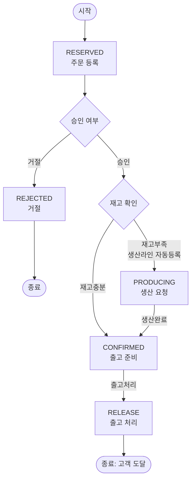

# PRD: 반도체 시료 생산주문관리 시스템 (S-Semi)

## 1. 목표/배경

가상회사 S-Semi의 반도체 시료 생산주문관리 시스템. 고객 요청(이메일, 시스템 외부)을 받아 주문담당자가 시스템에 주문을 접수하고, 생산담당자가 승인/거절하며, 재고 부족 시 생산라인에 자동 등록되어 생산 후 출고까지 이어지는 흐름을 관리한다.

기술 스택: Python, 파일 기반(JSON) 데이터 저장.

## 2. 도메인 모델

### 2.1 Sample (시료)

| 속성 | 설명 |
|---|---|
| 시료ID | 시료를 식별하는 고유 ID |
| 이름 | 시료 이름 |
| 평균생산시간 | 시료 1단위 생산에 소요되는 평균 시간 |
| 수율 | 정상시료 수 / 총생산시료 수 (예: 0.9면 100개 생산 중 정상품 90개) |

### 2.2 Inventory (재고)

Sample과 분리된 별도 엔티티. 재고는 자주 변동되는 값(주문승인 시 차감, 생산완료 시 증가)이라 정적 스펙인 Sample과 분리해 관리한다.

| 속성 | 설명 |
|---|---|
| 시료ID | Sample 참조 |
| 재고수량 | 현재 보유 재고 수량 |

### 2.3 Order (주문)

주문 1건은 단일 시료 + 수량으로 구성한다 (복수 시료 라인아이템 미지원).

| 속성 | 설명 |
|---|---|
| 주문ID | 주문을 식별하는 고유 ID |
| 고객명 | 주문 요청 고객 이름 |
| 시료ID | 주문 대상 시료 |
| 수량 | 주문 수량 |
| 상태 | RESERVED / REJECTED / CONFIRMED / PRODUCING / RELEASE |

주문 취소/수정은 RESERVED(미승인) 단계에서만 지원한다. 승인 이후(CONFIRMED/PRODUCING/RELEASE) 상태에서는 취소/수정할 수 없다.

## 3. Order 상태머신

### 3.1 구간별 담당자

| 구간 | 담당자 |
|---|---|
| RESERVED | 주문담당자 |
| 승인여부확인 ~ 출고처리(CONFIRMED) | 생산담당자 |
| PRODUCING | 생산라인 |
| END (RELEASE 이후 고객 도달) | 고객 |

### 3.2 상태별 설명

| 상태 | 설명 |
|---|---|
| RESERVED | 주문 등록 상태 (승인 대기) |
| REJECTED | 거절된 주문. 모니터링 대상에서 제외, 정상 흐름으로 취급하지 않음. 거절 사유 입력은 불필요 |
| CONFIRMED | 출고 준비 상태 (재고 확보 완료, 출고 대기) |
| PRODUCING | 생산 요청 상태 (재고 부족으로 생산라인에 등록되어 생산 중) |
| RELEASE | 출고 완료 상태 |

출고처리는 부분출고를 지원하지 않는다. CONFIRMED 주문은 전량 한 번에 RELEASE로 전환한다.

## 4. 역할별 권한표

| 역할 | 권한 |
|---|---|
| 고객 | 이메일로 시료 요청(시스템 외부 채널, 시스템 내 직접 입력 권한 없음) |
| 주문담당자 | 주문서 작성, 주문 접수(RESERVED 생성) |
| 생산담당자 | 개발시료 등록, 주문 승인/거절 결정 |

## 5. 메인 메뉴 5종 기능 정의

1. **시료관리**: 시료 등록 / 조회(전체 시료 목록) / 검색(키워드 필터)
2. **주문**: 주문 접수 / 승인 / 거절
3. **모니터링**: 주문량(상태별 카운트), 재고량(여유/부족/고갈) 확인
4. **출고처리**: CONFIRMED 상태 주문을 RELEASE 상태로 전환
5. **생산라인**: 현재 생산 중인 시료 및 대기큐(FIFO) 확인

생산라인은 N개(설정 가능, 기본값 1개)로 존재할 수 있다. PRODUCING 주문은 시료 종류와 무관하게 전체 통합 단일 FIFO 큐에 쌓이며, 라인이 유휴 상태가 될 때마다 큐 맨 앞 주문을 배정해 병렬로 생산한다.

### 5.1 시료관리 조회/검색 동작

- **조회**는 별도 시료ID 입력을 요구하지 않고, 등록된 전체 시료 목록을 보여준다.
- 등록된 시료가 없으면 프로그램을 종료하지 않고 "등록된 시료가 없습니다"에 해당하는 안내를 보여준다.
- **검색**은 기존처럼 키워드를 입력받아 시료 이름에 키워드가 포함된 시료만 보여준다.
- 검색 키워드 안내에는 시료 이름의 일부를 입력하면 된다는 설명과 예시를 함께 보여준다. 예: `Wafer-A`, `Wafer`, `Chip` 같은 전체 이름 또는 부분 문자열.
- 특정 시료ID로 찾는 단건 조회는 내부 repository/controller 유스케이스로 유지할 수 있지만, 콘솔 메뉴의 기본 조회 동작은 전체 목록 표시다.

### 5.2 콘솔 입력/요청 오류 복구 규칙

콘솔 프로그램은 사용자가 잘못된 값을 입력하거나 존재하지 않는 엔티티를 요청해도 처리되지 않은 예외로 종료되면 안 된다. 예상 가능한 사용자 입력 오류는 안내 메시지를 보여주고 현재 메뉴 또는 메인 메뉴 흐름으로 복귀한다.

- 숫자 입력 필드(주문 수량, 평균생산시간, 수율 등)에 숫자로 변환할 수 없는 값이 들어오면 오류 안내 후 메뉴 흐름으로 복귀한다.
- 도메인 값 검증에 실패하는 입력(예: 양수가 아닌 평균생산시간, 0 이하 또는 1 초과 수율, 음수 수량 등)은 오류 안내 후 메뉴 흐름으로 복귀한다.
- 존재하지 않는 주문ID/시료ID에 대한 조회, 승인, 거절, 취소, 출고 요청은 `None` 역참조나 상태전이 예외로 프로그램을 종료하지 않고 처리 불가/찾을 수 없음 안내를 보여준다.
- 주문 승인처럼 참조 시료가 필요한 작업에서 주문의 시료ID가 실제 시료로 등록되어 있지 않으면 생산 계산을 진행하지 않고 처리 불가로 응답한다.
- `KeyboardInterrupt` 같은 사용자의 명시적 중단은 이 규칙의 대상이 아니며, 일반 사용자 입력 오류만 복구 대상으로 삼는다.

### 5.3 모니터링 재고량 판정 기준

시료별로 아래 값을 비교해 여유/부족/고갈을 판정한다.

- 수요합계 = 해당 시료의 RESERVED 상태 주문 수량 합 + PRODUCING 상태 주문 수량 합
  (CONFIRMED는 이미 재고가 확보된 상태이므로 수요합계에서 제외)
- **고갈**: 재고수량 = 0
- **부족**: 0 < 재고수량 < 수요합계
- **여유**: 재고수량 >= 수요합계

## 6. 생산라인 계산식

- 부족분 = 주문수량 - 승인 시점의 재고수량 (재고부족으로 PRODUCING 전환된 주문 기준)
- 실생산량 = ceil(부족분 / 수율)
- 총생산시간 = 평균생산시간 * 실생산량

각 PRODUCING 주문은 승인 시점 기준으로 자신만의 부족분/실생산량을 계산해 생산작업 하나를 큐에 등록한다. 같은 시료에 여러 주문이 PRODUCING 상태여도 이 계산은 주문별로 독립적으로 이루어진다.

### 6.1 생산 결과 재고 반영 (잉여 처리)

생산되는 시료는 전부 정상품으로 간주한다(불량품 개념 없음). 수율은 실생산량 계산(부족분을 채우기 위해 몇 개를 생산해야 하는지)에만 쓰이는 비율이다. 실생산량이 부족분보다 많이 계산되는 이유는 ceil 올림 때문이며, 이 초과분(잉여)은 버리지 않고 Inventory 재고수량에 그대로 남는다 (잉여 = 실생산량 - 부족분. 수율=1이거나 나누어떨어지면 잉여=0).

### 6.2 동시 생산 처리 규칙

생산라인은 시료 1단위를 만들 때마다 그 즉시 Inventory 재고수량에 반영한다 (자신의 생산작업 전체 완료를 기다리지 않고 실시간 반영). PRODUCING 큐에서 대기 중인 다른 주문들은 이렇게 실시간으로 늘어난 재고를 큐 앞에서부터(FIFO) 순서대로 즉시 소비하며, 자신의 부족분이 채워지는 순간 CONFIRMED로 전환된다.

단, **현재 실제로 생산이 진행 중인 주문 자신은 예외**다 — 자신의 실생산량 전량 생산이 끝나야만 CONFIRMED로 전환되며, 도중에 자신의 필요량(부족분)이 채워지더라도 전체 생산작업 완료까지 기다린다.

**예시**: SampleA에 100ea 주문(부족분 100, 실생산량 150)이 먼저 PRODUCING으로 생산 중이고 20ea 주문(부족분 20)이 큐에서 대기 중이면:
- 생산라인이 실시간으로 100ea 주문 몫(100개)을 채운 뒤 이어서 20ea 주문 몫(20개)까지 채워 누적 120개가 되는 시점에 20ea 주문은 CONFIRMED된다.
- 100ea 주문 자신은 실생산량(150) 전량이 끝나야 CONFIRMED된다 — 그 결과 100ea가 20ea보다 늦게 CONFIRMED될 수 있다.
- 남은 30개(150-120)는 6.1의 잉여로 재고에 남는다.
